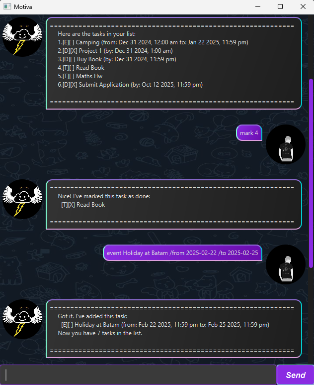

# Motiva: Task Management Chatbot

<p align="center"></p>

Motiva is a personal task management chatbot designed to help you keep track of your to-dos, deadlines, and events. 
It provides a simple yet powerful way to manage your daily tasks, featuring a graphical user interface (GUI) 
built with JavaFX. Whether you need to track your to-dos, set deadlines, or schedule events, Motiva ensures you stay 
on top of your responsibilities with ease. 🌟

## Features ✨

- **📌 Task Tracking** : Add tasks, mark them as done, and manage them effortlessly.
- **⏳ Set Deadlines** : Keep track of important due dates.
- **📅 Schedule Events** : Plan your meetings, gatherings, and other events.
- **💾 Persistent Storage** : Motiva remembers your tasks even after you exit.

## How to Get Started 🚀

1. **Download the latest release** from [here](https://github.com/TheEnd-alr-taken/ip/releases).
2. **Run the application** using:
   ```sh
   java -jar motiva.jar
   ```
3. **Add tasks** using simple commands.
4. **Enjoy a more organized life!** 😉

## Supported Commands🔥

You can interact with Motiva using the following commands:

```
list                 	    # Lists all tasks
sort                        # Sort the task chronologically
bye                         # Exits the application
mark <index>                # Marks a task as done
unmark <index>              # Unmarks a task
delete <index>              # Deletes a task
find <keyword>              # Finds tasks containing the keyword
todo <task description>                             # Adds a new to-do
deadline <task description> /by <date>              # Adds a new deadline
event <task description> /from <date> /to <date>    # Adds a new event
```
---
## 📆 Supported Date-Time Formats

Motiva accepts **two formats** for date-time:

### ⏳ `yyyy-MM-dd HHmm` (More specific)
- Example: `2025-12-31 2359` → **Dec 31 2025, 11:59 pm**
- Example: `2024-07-01 0900` → **Jul 01 2024, 9:00 am**

### 📅 `yyyy-MM-dd` (Defaults to 23:59 if time is not provided)
- Example: `2025-12-31` → **Dec 31 2025, 11:59 pm**
- Example: `2024-07-01` → **Jul 01 2024, 11:59 pm**

---

## Example Usage 🛠️

Motiva operates through simple commands that allow you to manage your tasks efficiently. 
Just type a command, and Motiva will take care of the rest.

### 📜List all your task: `list`
List all your tasks, deadlines, and events.

---
### 📝Create To-Do task: `todo <task description>`
Add a new task to your to-do list! 

Example: `todo Read Book`

---
### ⏳Create Deadline task: `deadline <task description> /by <DueDate>`
Set a deadline for your task.

Example: `deadline Submit Application /by 2025-10-12 2359`

---
### 📅Create Event task: `event <task description> /from <StartDate> /to <EndDate>`
Schedule an event with a start and end time.

Example: `event Camping /from 2024-12-31 0000 /to 2025-1-22`


